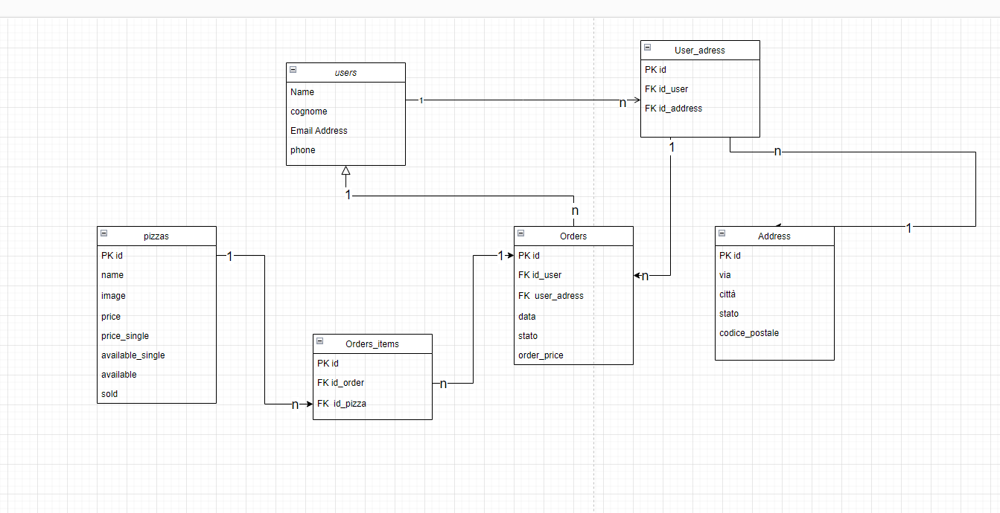

## Backend Progetto finale 2.0 
- [repo versione laravel 10](https://github.com/Francescodc92/pizzeria-backend)
- [repo frontend (temporaneo)](https://github.com/Francescodc92/pizzeria-full-stack)

### Progetto db

## TODO
  ### Admin 
  4. (da pensare ) un grafico per il numero di utenti registrati se necessario

  ### Employee
  1. creare un layout per i dipendenti con un componente navigation specifico in modo da mostrare le rotte specifiche 
      - al login aggiungere l'accesso diretto alla rotta employees come fatto per gli admin
    
    pagine necessarie
      - pizze
          - index (senza la possibilità di modificare, creare o cancellare)
          - show (solo visualizzazione)
      - utenti
          - index (solo visualizzazione e ricerca)
          - show (visualizzazione info e lista ordini)
      - ordini
          - index (visualizzazione, filtraggio)
          - show (cambio stato ordine, visualizzazione utente e pizza)
      - statistiche non accessibili

    - creare le rotte 
    - creare i controllers
    - creare le viste modificate per i dipendenti
      
  ### User (api)
  decidere se modificare il vecchio frontend o se ricostruirlo da 0 (molto probabilmente ricostruirlo)
  1. sistemare il frontend perche funzioni con il nuovo backend (temporaneamente)
      - adattare le rotte api del progetto con laravel10 alle nuove rotte laravel11 (cambiare i campi modificati nel nuovo progetto)
      - creare la rotta per la visualizzazione degli ordini dell'utente
      - creare le rotte per le pizze
        - implementare il ritorno delle sole pizza disponibili 
  2. permettere all'utente di poter eliminare gli ordini che ha fatto in precedenza (aggiungere un campo nella tabella che servirà a non far ritornare quell'ordine al frontend)

  ### future aggiunte
  1. aggiungere una tabella ingredienti per dare opzione di cambiare ingrediente specifico
  2. aggiungere una tabella dipendenti specifica dove inserire i dati dei contratti (scadenza, retribuzione, ruolo specifico ecc )
  3. parte di gestione specifica dei dipendenti 

### Tecnologie:
  - laravel 11
    - Breeze
    - sanctum
    - spatie (gestione dei ruoli)
  - docker
  - tailwind css
  - mySql 