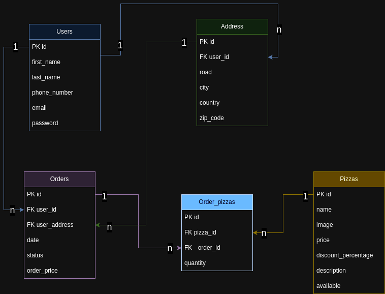

## Backend Progetto finale 2.0 
- [repo versione laravel 10](https://github.com/Francescodc92/pizzeria-backend)
- [repo frontend (temporaneo)](https://github.com/Francescodc92/pizzeria-full-stack)

### Progetto db

## TODO
  - sistemare il componente di paginazione default di laravel

### Tecnologie:
  - laravel 11
    - Breeze
    - sanctum
    - spatie (gestione dei ruoli)
  - docker
  - tailwind css
  - mySql 